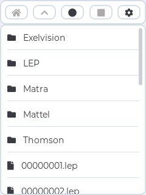
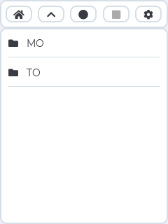
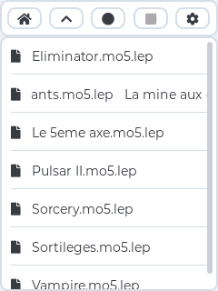
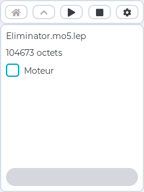
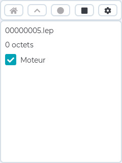
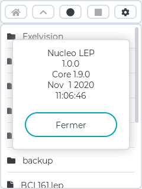

# Nucleo LEP
Nucleo LEP est un lecteur enregistreur de fichiers LEP basé sur une carte Nucleo.

## Présentation
Nucleo LEP permet de lire et écrire des fichiers LEP sur un micro-ordinateur.

Le format de fichier LEP créé par Daniel Coulom est documenté sur cette [page](http://dcmoto.free.fr/bricolage/sdlep-reader/index.html).

Ce système constitue une alternative à l'utilisation d'un lecteur enregistreur de cassette analogique, utilisé comme mémoire de masse.

## Installation
Nucleo LEP est constitué de plusieurs éléments. En fonction du micro-ordinateur utilisé, une connectique spécifique sera utilisée.

### Matériel
* Une carte [Nucleo-F429ZI](https://www.st.com/en/evaluation-tools/nucleo-f429zi.html).
* Un écran TFT tactile avec lecteur de micro carte SD intégré.
* Une carte micro SD.

En ce qui concerne l'écran, il existe de nombreux modèles avec différents contrôleurs. Il faudra en conséquence adapter la gestion de l'écran.
L'écran utilisé est parfaitement géré par la librairie MCUFRIEND_kbv pour l'affichage et la librairie Adafruit TouchScreen pour le tactile.

Les fichiers **.LEP** doivent être copiés sur la carte SD. Les sous-répertoires sont autorisés.

### Câblage
La première étape consiste à installer l'écran tactile sur la carte Nucleo.
Le connecteur CN9 de la carte Nucleo est utilisé pour la liaison avec le micro-ordinateur utilisé :

CN9|NucleoLEP|Direction|Ordinateur|Remarque
:---:|:---|:---:|:---|:---
GND|ground|<->|ground|Masse commune
PF8|input|<-|output|Ecriture 
PD0|motor|<-|remote|Commande de moteur.
PF7|output|->|input|Lecture

## Logiciel
Pour développer l'application, l'IDE Eclipse, le plugin Sloeber et le core officiel de STMicroelectronics sont utilisés :
* [Eclipse CDT](https://www.eclipse.org/cdt/) 2020-06
* [Sloeber](https://eclipse.baeyens.it/) 4.3.3
* Core officiel [Arduino STM32](https://github.com/stm32duino/Arduino_Core_STM32) 1.9.0.

### Librairies
L'application utilise plusieurs librairies :
* Adafruit BusIO 1.6.0
* Adafruit GFX Library 1.10.2
* Adafruit TouchScreen 1.1.1
* LVGL 7.7.0
* MCUFRIEND_kbv 2.9.9
* SdFat 1.1.4

### Modifications
Il est nécessaire de modifier le core Arduino. Ces modifications sont [intégrées](http://github.com/stm32duino/Arduino_Core_STM32/pull/1209) à la version de développement du core.
Dans le fichier **core/HardwareTimer.h**, remplacer
```cpp
#if defined(STM32F1xx) || defined(STM32F2xx) ||defined(STM32F4xx) || defined(STM32F7xx) || defined(STM32H7xx)
#if defined(TIMER13_BASE)
    if (HardwareTimer_Handle[TIMER13_INDEX]) {
      HAL_TIM_IRQHandler(&HardwareTimer_Handle[TIMER13_INDEX]->handle);
    }
#endif // TIMER13_BASE
#endif
```
par
```cpp
#if defined(STM32F1xx) || defined(STM32F2xx) ||defined(STM32F4xx) || defined(STM32F7xx) || defined(STM32H7xx)
#if defined(TIM13_BASE)
    if (HardwareTimer_Handle[TIMER13_INDEX]) {
      HAL_TIM_IRQHandler(&HardwareTimer_Handle[TIMER13_INDEX]->handle);
    }
#endif // TIM13_BASE
#endif
```
Pour pouvoir compiler la librairie LVGL, il faut ajouter une directive de compilation pour indiquer comment configurer la librairie.
```makefile
-DLV_CONF_INCLUDE_SIMPLE
```
Si votre écran utilise un composant HX8347, il est nécessaire de décommenter une ligne du fichier **MCUFRIEND_kbv.cpp** pour activer le support de ce composant.
```cpp
#define SUPPORT_8347D
```
La modification du paramètre **NUMSAMPLES** du fichier **TouchScreen.cpp** de la librairie permet d'améliorer la gestion du tactile.
```cpp
#define NUMSAMPLES 4
```
## Utilisation
### Interface
La capture d'écran suivante présente l'écran de démarrage de l'application.



L'écran est divisé en deux parties :
- Une barre de boutons.
- Une zone de travail.

|Bouton|Action|
|--|--|
||Accès à la racine de la carte SD|
||Accès au répertoire parent de la carte SD|
||Lecture de fichier|
||Ecriture de fichier|
||Arrêt de l'opération et retour au mode navigation|
||Affichage des informations de version|

|Icône|Type de fichier|
|--|--|
||Répertoire|
||Fichier|
### Navigation
A partir de l'écran de démarrage, la sélection d'un répertoire (par exemple **Thomson**) permet d'afficher le contenu du répertoire.



Les boutons  et  sont alors actifs.

La sélection du répertoire **MO** affiche le contenu du répertoire.



Une barre de défilement permet d'accèder aux éléments du système de fichiers qui ne sont pas affichés.

Si le nom d'un élément est trop long pour être affiché en totalité, une animation le fait défiler horizontalement (par exemple **La mine aux diamants.mo5.lep**).

### Lecture
Pour lire un fichier, il faut naviguer dans le système de fichiers pour sélectionner le fichier à lire. L'écran de lecture est affiché.



Le nom et la taille du fichier à lire sont affichés, ainsi que l'état de la commande du moteur du lecteur et une barre de progression de lecture. 

|Bouton|Action|
|--|--|
||Lecture|
||Arrêt de l'opération et retour au mode navigation|

L'appui sur le bouton lecture démarre la lecture.

L'appui sur le bouton d'arrêt permet d'arrêter ou d'annuler la lecture et de retourner en mode navigation.

### Ecriture
L'écriture d'un fichier se fait dans le répertoire courant. Pour écrire un fichier, il faut naviguer dans le système de fichiers puis appuyer sur le bouton écriture. L'écran d'écriture est affiché.



Le nom et la taille du fichier à écrire sont affichés, ainsi que l'état de la commande du moteur du lecteur. Le nom du fichier est déterminé par le l'application. La taille du fchier est actualisée pendant l'écriture. 

|Bouton|Action|
|--|--|
||Arrêt de l'opération et retour au mode navigation|

L'appui sur le bouton d'arrêt permet d'arrêter l'écriture et de retourner en mode navigation.

### Information de version
L'appui sur le bouton de configuration affiche une fenêtre qui comporte des informations de version.


Pour fermer la fenêtre, il faut appuyer sur le bouton Fermer.